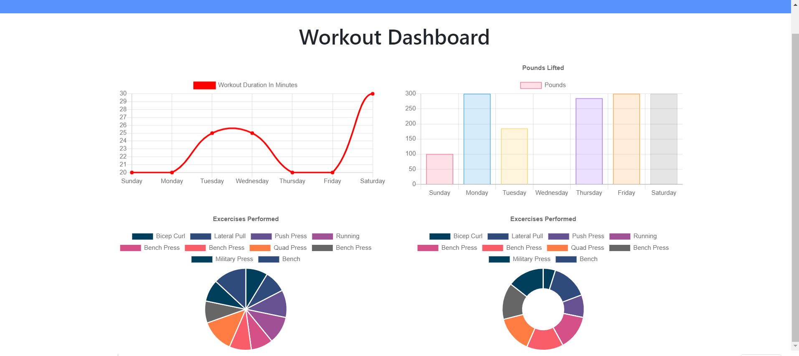

# Fitness Tracker

</br>
<p align="center">
    
    
    
       
    
    
    
    
      
      
      
</p>


## Description

Track your workouts with Fitness Tracker. The app will keep track of every exercise in your workout. The app dashboard will display weekly summary graphs of all workouts done in a week.

## Table of Contents

* [Installation](#installation)
* [Usage](#usage)
    * [Screenshots](#screenshots)
    * [Snippets](#snippets)
* [Credits](#credits)
* [License](#license)

## Installation

1. Clone repository. 
2. Check in routes/api-routes and comment in block of code if you want the database to be prepopulated with dummy values
3. npm install
4. node server.js

Running seeders/seed.js is optional to have a prepopulated database.

<p align="center">
    <a href="https://track-your-fitness.herokuapp.com/"></a>
</p>


## Usage

### Screeshots

1. Homepage displaying last workout


2. Creating Workouts


3. Last Week's Summary



### Snippets


1. Adding to an array type

```javascript

    // add exercise
    app.put("/api/workouts/:id", (req, res) => {

        db.Workout.findOneAndUpdate(
            { _id: req.params.id },
            {
                $inc: { totalDuration: req.body.duration },
                $push: { exercises: req.body }
            },
            { new: true }).then(dbWorkout => {
                res.json(dbWorkout);
            }).catch(err => {
                res.json(err);
            });

    });
    
```
* This function will add an exercise to the array of exercises that belong to the workout with the given id. Here we will locate the workout with the given ID and update its fields. We will increase the total duration of the workout by the duration of the exercise being inserted. We will push the exercise to the array of exercises.


## Credits

### Author

- 💼 Carlos Toledo: [portfolio](https://professional-portfolio2020.herokuapp.com/)
- :octocat: Github: [kqarlos](https://www.github.com/kqarlos)
- LinkedIn: [carlos-toledo415](https://www.linkedin.com/in/carlos-toledo415/)

### Built With

</br>
<p align="center">
    <a href="https://developer.mozilla.org/en-US/docs/Web/HTML"></a>
    <a href="https://developer.mozilla.org/en-US/docs/Web/CSS"></a>
    <a href="https://www.javascript.com/"></a>
    <a href="https://getbootstrap.com/"></a>
    <a href="https://nodejs.org/en/"></a>
    <a href="https://www.npmjs.com/package/express"></a>
    <a href="https://www.mongodb.com/"></a>
</p>

## License


</br>
<p align="center">
    
</p>
